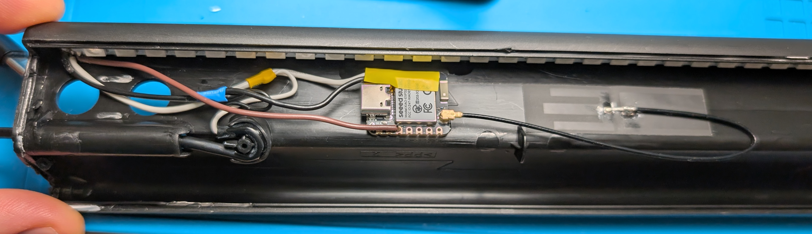

# IKEA SKAFTSÄRV — Matter over Thread

Matter-over-Thread firmware for an IKEA SKAFTSÄRV accent lamp with its control board
replaced by a **Seeed XIAO ESP32-C6**. The lamp's original 30-LED WS281x strip is kept
and driven as a single Matter **Extended Color Light**, with a few animated effects
exposed through the Mode Select cluster.

No Wi-Fi. The radio runs OpenThread only; BLE is used for commissioning and then
released.

Built on [esp-matter](https://github.com/espressif/esp-matter). The teardown and the
wire colours follow
[simoneluconi/SKAFTSARV-to-WLED](https://github.com/simoneluconi/SKAFTSARV-to-WLED),
which does the same mod with WLED instead of Matter.

---

## Hardware



### Strip

| Property | Value |
|---|---|
| LEDs | 30 |
| Type | WS281x |
| Colour order | GRB |
| Supply | 5 V |

### Wiring

| Strip wire | Signal | XIAO pad | GPIO |
|---|---|---|---|
| brown | data | `D2` | **2** |
| white | +5 V | `5V` | — |
| black | GND | `GND` | — |

| Other | XIAO pad | GPIO | Notes |
|---|---|---|---|
| Factory reset | BOOT | 9 | long press ≥ 5 s; only reachable with the lamp open |
| RF switch enable | — | 3 | reserved, never repurpose |
| Antenna select | — | 14 | reserved, never repurpose |

The lamp's original two buttons and microphone are not used.

### Things worth getting right

- **Logic level.** A 3.3 V data line into a 5 V WS281x is marginally out of spec. Put a
  **330–470 Ω resistor in series with the data wire** at the ESP end and keep that wire
  short. If the first pixel or two misbehave while the rest are fine, drop the strip's
  V+ through a 1N4001 (≈ 4.4 V) to bring its logic threshold down to meet the ESP.
- **Bulk capacitance.** A **470–1000 µF** electrolytic across 5 V and GND at the strip
  end absorbs the inrush when 30 LEDs switch on together.
- **Current.** 30 WS2812s at full white draw roughly **1.8 A**. This firmware does not
  cap that. Do not daisy-chain the strip's 5 V through the XIAO: run the strip's +5 V
  and the XIAO's `5V` pad as two legs from the *same* point on the supply, and give the
  supply at least 2 A of headroom.
- **Antenna.** The firmware defaults to the XIAO's onboard ceramic antenna, which is
  the right choice for a board sealed inside a plastic lamp body. Enable
  `CONFIG_SKAFT_USE_EXTERNAL_ANTENNA` only if a U.FL antenna is physically fitted.

---

## What Matter sees

One endpoint, device type **Extended Color Light (0x010D)**:

| Cluster | Notes |
|---|---|
| On/Off | with the Lighting feature, so the last state is restored on power-up |
| Level Control | Matter 0–254, gamma-corrected before it reaches the LEDs |
| Color Control | FeatureMap and ColorCapabilities `0x0019` — **HS \| XY \| CT** |
| Identify | blinks the whole strip at about 1 Hz |
| Mode Select | the effect picker (see below) |

The strip is RGB only, so **colour temperature is an approximation**: kelvin goes
through esp-matter's `temp_to_hs()` and comes out as tinted white, not true white. CT is
included anyway because 0x010D mandates it and there is no Matter device type for
hue/XY without it — a light that advertises 0x010D and then omits CT is misrendered or
rejected by some ecosystems.

### Attribute → strip mapping

| Cluster / attribute | Effect on the strip |
|---|---|
| `OnOff::OnOff` | brightness scale goes to 0; colour and effect are retained |
| `LevelControl::CurrentLevel` | 0–254 → gamma LUT → 0–255 scale on every channel |
| `ColorControl::CurrentHue` / `CurrentSaturation` | `hsv_to_rgb()`, selects HS mode |
| `ColorControl::ColorTemperatureMireds` | `K = 1000000 / mireds` → `temp_to_hs()` → `hsv_to_rgb()` |
| `ColorControl::CurrentX` / `CurrentY` | `xy_to_rgb()`, selects XY mode |
| `ModeSelect::CurrentMode` | selects the effect |

Transitions (`MoveToHueAndSaturation`, `MoveToColorTemperature`, `MoveToLevel` with a
transition time) are handled by the CHIP cluster servers, which emit a stream of
attribute updates. There is no fade engine here; the render loop is fast enough that
they look smooth.

### Effects

| Mode | Name | Uses the chosen colour |
|---|---|---|
| 0 | Solid | yes |
| 1 | Rainbow | no |
| 2 | Colour Wipe | yes |
| 3 | Breathe | yes |
| 4 | Twinkle | yes |
| 5 | Fire | no |
| 6 | Theater Chase | yes |

**Home Assistant** renders Mode Select as a "Effect" select in the device's
Configuration block. **Apple Home and Google Home ignore the cluster entirely** — they
will show a normal colour light and no effect picker.

Because of that, **changing the colour from any app drops the lamp back to Solid.**
Otherwise someone on Apple Home could start Rainbow from Home Assistant and have no way
out. Changing brightness or turning the lamp off and on leaves the effect running.

---

## Build

```bash
cd ~/esp-matter && source ./export.sh          # ESP-IDF v5.5.2
export ESP_MATTER_PATH=~/esp-matter
export IDF_CCACHE_ENABLE=1

cd ~/esp-matter/SKAFTSARV-thread
idf.py set-target esp32c6
idf.py build
```

Sanity-check `build/config/sdkconfig.h` afterwards: `CONFIG_OPENTHREAD_ENABLED`,
`CONFIG_OPENTHREAD_FTD`, `CONFIG_SUPPORT_COLOR_CONTROL_CLUSTER`,
`CONFIG_SUPPORT_MODE_SELECT_CLUSTER`,
`CONFIG_ESP_MATTER_MODE_SELECT_CLUSTER_ENDPOINT_COUNT 1`, `CONFIG_FREERTOS_HZ 1000`, and
no `CONFIG_ENABLE_WIFI_STATION`. Check that `dependencies.lock` resolved
`espressif/led_strip` to **1.0.0** — see [Implementation notes](#implementation-notes).

## Flash

```bash
idf.py -p /dev/cu.usbmodem2101 flash monitor
```

## Bench-test the strip before commissioning

Over the `skaft>` console on the USB port:

```
selftest          # walks red, green, blue then white along the strip
rgb 255 0 0       # if this shows GREEN, the wire order is not GRB
pixel 29 0 0 255  # last pixel blue: confirms the count really is 30
level 10          # should be a smooth dim glow, not two or three steps
clear
```

Nothing lights at all? Check the 5 V rail *at the strip end*, the series resistor, and
that the brown wire is on D2. Only the first few pixels respond? Suspect the 3.3 V logic
level and try the 1N4001 trick above.

## Factory data

Run this **before** the first commissioning:

```bash
esp-matter-mfg-tool -n 1 -v 0xFFF1 -p 0x8003 \
  --vendor-name "ChaikaMatter" --product-name "SKAFTSARV_Light" \
  --hw-ver 1 --hw-ver-str "1.0"

esptool.py --chip esp32c6 -p /dev/cu.usbmodem2101 \
  write_flash 0x10000 out/fff1_8003/<uuid>/<uuid>-partition.bin
```

`0x10000` **is** the `nvs` partition, which is also where OpenThread keeps its
credentials, so writing the factory blob wipes Thread credentials and every fabric.
That is why it has to happen before you pair, not after. Pairing codes are in the
generated `*-onb_codes.csv` and `*-qrcode.png`.

## Commission

Pair over BLE → Thread with a Thread Border Router on the network, from Apple Home,
Google Home, Home Assistant, or `chip-tool pairing ble-thread`. Then:

```bash
# Capabilities: both should read 0x19 (HS | XY | CT)
chip-tool colorcontrol read feature-map        <node> 1
chip-tool colorcontrol read color-capabilities <node> 1

chip-tool onoff on <node> 1
chip-tool levelcontrol move-to-level 127 0 0 0 <node> 1
chip-tool colorcontrol move-to-hue-and-saturation 85 254 0 0 0 <node> 1
chip-tool colorcontrol move-to-color-temperature 500 0 0 0 <node> 1   # 2000 K
chip-tool colorcontrol move-to-color 11700 4400 0 0 0 <node> 1        # xy

chip-tool modeselect read supported-modes <node> 1   # must list all 7
chip-tool modeselect change-to-mode 1 <node> 1       # rainbow
chip-tool identify identify 10 <node> 1
```

An **empty** `supported-modes` means `mode_table_register()` did not run before
`esp_matter::start()`; Home Assistant will then silently decline to create the select.

---

## Console commands

Available on the USB-Serial-JTAG port when `CONFIG_SKAFT_ENABLE_CONSOLE` is on.

| Command | Description |
|---|---|
| `status` | current power, level, colour mode, base colour, effect |
| `rgb <r> <g> <b>` | paint the whole strip one colour |
| `pixel <i> <r> <g> <b>` | paint a single pixel |
| `clear` | blank the strip |
| `level <0-254>` | set brightness; also hands the strip back to Matter |
| `selftest` | walk R/G/B/W along the strip to check count and wire order |
| `release` | hand the strip back to Matter |
| `factoryreset` | erase Thread credentials and all fabrics |

`rgb`, `pixel`, `clear` and `selftest` take the strip away from the render loop. Any
Matter update — or `level`/`release` — gives it back.

## Configuration

`idf.py menuconfig` → **SKAFTSARV Light**

| Option | Default |
|---|---|
| `SKAFT_LED_GPIO` | 2 (D2) |
| `SKAFT_LED_COUNT` | 30 |
| `SKAFT_LED_RMT_CHANNEL` | 0 |
| `SKAFT_LED_MEM_BLOCKS` | 2 |
| `SKAFT_RENDER_FPS` | 50 |
| `SKAFT_GAMMA_X10` | 22 (γ = 2.2) |
| `SKAFT_CT_MIN_KELVIN` | 2000 (→ 500 mireds) |
| `SKAFT_CT_MAX_KELVIN` | 6500 (→ 153 mireds) |
| `SKAFT_ENABLE_CONSOLE` | y |
| `SKAFT_USE_EXTERNAL_ANTENNA` | n |

Device identity lives in `sdkconfig.defaults.esp32c6` (`0xFFF1` / `0x8003`) and
`main/CMakeLists.txt` (`ChaikaMatter` / `SKAFTSARV_Light`).

---

## Implementation notes

**Why there is a strip driver here at all.** esp-matter ships a WS2812 backend
(`device_hal/led_driver/ws2812/led_driver.c`) but it is a one-pixel design in three
independent places: `LED_STRIP_DEFAULT_CONFIG(1, ...)`, a hardcoded pixel index of `0`,
and module-level static colour state. No esp-matter example drives more than one
addressable LED. `main/strip.c` replaces it. What *is* reused is
`device_hal/led_driver/utils/color_format.c` — `hsv_to_rgb()`, `temp_to_hs()` and
`xy_to_rgb()` — which is compiled into every backend and already on the include path.

**Why the legacy RMT driver.** `device_hal/led_driver` is part of this build (the
esp32c6 device config selects `led_type=ws2812`), and it includes the legacy
`driver/rmt.h`. ESP-IDF aborts at boot if an image links both the legacy and the modern
RMT drivers, so `main/strip.c` stays on the legacy API and on
`espressif/led_strip` **1.x**. That version constraint in `main/idf_component.yml` has to
match the one `device_hal/led_driver` declares, or the component manager cannot resolve
a single version. The esp-matter driver is never initialised, so the strip owns the
peripheral outright.

**RMT buffering.** The channel claims **both** of the C6's TX memory blocks (96 symbols,
about 120 µs) rather than the default one. The legacy driver refills the block from an
ISR that competes with the 802.15.4 radio, and a late refill latches the strip mid-frame
as a visible flicker. If you still see flicker under heavy Matter traffic, lower
`SKAFT_RENDER_FPS`.

**Gamma.** Level is mapped through a γ = 2.2 lookup table before it scales the colour.
Linear 8-bit dimming on a WS281x wastes most of its range at the top and collapses the
bottom into a handful of visible steps.

**Idle cost.** A solid colour is transmitted once and then the strip is left alone —
only animated effects and Identify redraw every frame.

**Task priority.** The render task runs at priority 2, below OpenThread and lwIP.
Jitter in an animation is invisible; a missed 802.15.4 deadline is not.

**Hue/saturation is layered on.** `extended_color_light::add()` hard-wires only CT and
XY and offers no way to request HS, so `app_main.cpp` fetches the ColorControl cluster
after `create()` and calls `hue_saturation::add()` on it.

**Mode Select needs its own backing store.** esp-matter creates the cluster but
registers `SupportedModes` as an empty, internally-managed array; CHIP reads the real
list from a `SupportedModesManager` that esp-matter does not supply.
`main/mode_table.cpp` provides one, built from `effects_name()` so the labels cannot
drift from the renderers.
